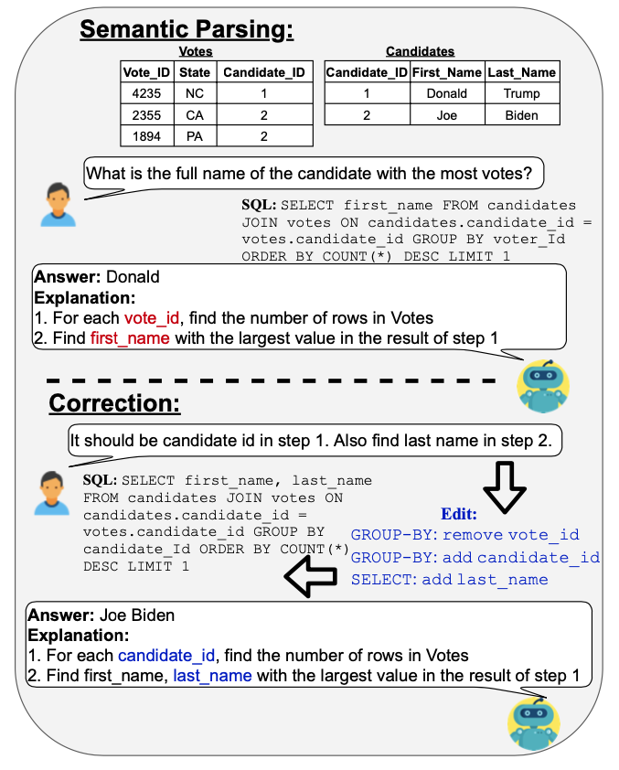

# NL-Edit: Correcting Semantic Parse Errors through Natural Language Interaction

Soon, we will use this repo to release the code and datasets used in 

NL-EDIT: Correcting semantic parse errors through natural language interaction.<br />
Ahmed Elgohary, Christopher Meek, Matthew Richardson, Adam Fourney, Gonzalo Ramos and Ahmed Hassan Awadallah.<br />
NAACL 2021.



## Setup

conda create -n nledit python=3.7

Install: nltk, numpy, attrs, jsonnet

To generate synthetic data:
    cd src/dataaugmentation
    python main.py configs.jsonnet


## Citation
 
```
@inproceedings{Elgohary21NLEdit,
Title = {{NL-EDIT}: Correcting Semantic Parse Errors through Natural Language Interaction},
Author = {Ahmed Elgohary and Christopher Meek and Matthew Richardson and Adam Fourney and Gonzalo Ramos and Ahmed Hassan Awadallah},
Year = {2021},
Booktitle = {Conference of the North American Chapter of the Association for Computational Linguistics (NAACL)},
}
```
